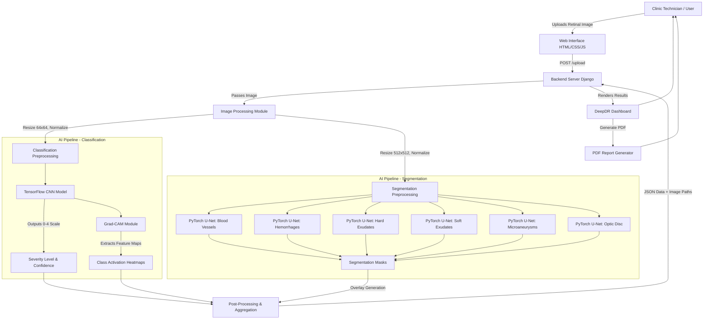

# DeepDR: System Architecture & Data Flow

This document outlines the detailed architecture and step-by-step data flow of the DeepDR system. You can use this to design a formal architectural diagram for your research paper.

## 1. High-Level Architecture Diagram

Below is a Mermaid diagram visualizing the entire system pipeline from the user interface to the AI models and back to the output report.

---

## 2. Step-by-Step Data Flow

### Phase 1: Input & Pre-Processing
1. **Image Upload:** The user uploads a patient's retinal fundus image (e.g., JPG, PNG) via the web-based UI.
2. **Backend Routing:** The backend (Django) receives the image file and saves it temporarily in the `media/scans/original/` directory.
3. **Data Preprocessing:** The `ml_pipeline.py` script intercepts the image and creates two distinct data streams because the models have different input requirements:
   - **Stream A (Classification):** Resizes the image to 64x64 pixels, normalizes pixel values (e.g., dividing by 255), and converts it into a NumPy array matching the TensorFlow CNN input shape `(1, 64, 64, 3)`.
   - **Stream B (Segmentation):** Resizes the image to a higher resolution (e.g., 512x512) and converts it into PyTorch Tensors `(B, C, H, W)` for the 6 U-Net models.

### Phase 2: Parallel Model Inference
To ensure sub-15 second response times, DeepDR runs the models simultaneously.

1. **Severity Classification (TensorFlow):** 
   - The preprocessed 64x64 tensor is fed into the CNN.
   - The model outputs a continuous float or an array of probabilities.
   - Post-processing rounds/clamps this output to a discrete integer representing the DR Stage (0: No DR, 1: Mild, 2: Moderate, 3: Severe, 4: Proliferative).
2. **Explainable AI Generation (Grad-CAM):**
   - Gradients are extracted from the final convolutional layer of the CNN.
   - A heatmap is generated showing which parts of the retina caused the model to predict that specific severity level.
3. **Biomarker Segmentation (PyTorch):**
   - Six distinct U-Net models are loaded.
   - The PyTorch tensor is passed through each model independently.
   - Each model outputs a probability mask (values between 0 and 1).
   - A sigmoid activation is applied, and the masks are thresholded (e.g., > 0.5) to create binary black-and-white masks isolating the specific abnormalities.

### Phase 3: Post-Processing & Overlay Generation
1. **Mask Coloring & Overlaying:** 
   - The raw binary masks from the U-Nets are color-coded (e.g., Red for hemorrhages, Yellow for exudates, Blue for vessels).
   - `cv2.addWeighted()` is used to seamlessly blend these colored masks over the original fundus image, creating clinical overlay maps.
2. **Data Aggregation:** 
   - The Django backend gathers the integer severity level, the confidence probability score, the file paths to the generated Grad-CAM heatmaps, and the file paths to the 6 segmentation overlays.

### Phase 4: Output & Reporting
1. **Dashboard Rendering:** The backend sends the aggregated data context back to the frontend.
2. **UI Update:** The clinical dashboard updates asynchronously to show the patient's severity risk badge, the confidence percentage, and a toggleable gallery of the segmentation maps.
3. **Report Generation:** If the user clicks "Export PDF", the system compiles the original image, classification results, and maps into an HTML template, which is converted to a downloadable PDF for the patient's medical file.
