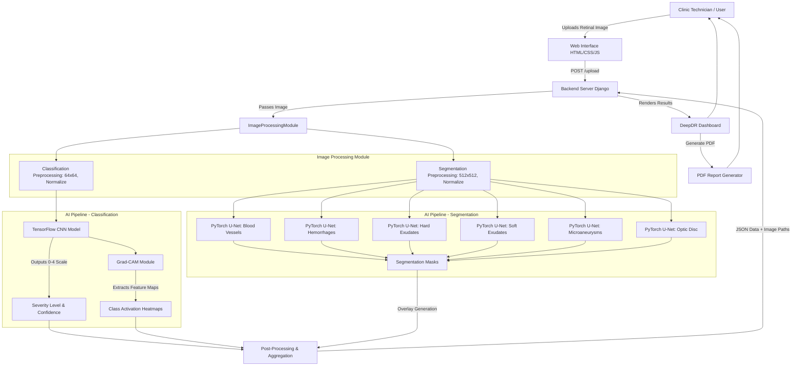

# DeepDR: AI-Powered Diabetic Retinopathy Diagnostic System

[](https://www.python.org/)
[](https://www.djangoproject.com/)
[](https://pytorch.org/)
[](https://tensorflow.org/)

DeepDR is a state-of-the-art, web-based, multi-model AI diagnostic console designed to assist doctors in pre-validating and grading **Diabetic Retinopathy (DR)** in clinical settings. The system processes retinal fundus images and provides two layers of clinical insight within seconds: a 5-level severity classification and pixel-level segmentation maps mapping key retina biomarkers and lesions.

---

## 🌟 Key Features

* **5-Level Severity Classification**: Categorizes DR into standard clinical stages:
  1. *No Diabetic Retinopathy*
  2. *Mild Diabetic Retinopathy*
  3. *Moderate Diabetic Retinopathy*
  4. *Severe Diabetic Retinopathy*
  5. *Proliferative Diabetic Retinopathy*
* **6-Channel Anatomical & Lesion Segmentation**: Pixel-level binary and transparent colored overlays generated by 6 independent PyTorch U-Net models for:
  * **Blood Vessels** (Green overlay)
  * **Hemorrhages** (Orange overlay)
  * **Hard Exudates** (Yellow overlay)
  * **Microaneurysms** (Red overlay)
  * **Optic Disc** (Purple overlay)
  * **Soft Exudates / Cotton Wool Spots** (Light Blue overlay)
* **Explainable AI (XAI)**: Generates class activation maps using **Grad-CAM** to highlight which parts of the retina most influenced the classification model, with cross-validation overlays correlating classification focus with segmentation masks.
* **Clinical Grading Dashboard**: Interactive UI for clinicians to review scans, toggle individual segmentation layers, modify AI findings, write clinical notes, and sign off diagnoses.
* **Automated PDF Diagnostic Reports**: Instantly generates complete clinical reports containing patient metadata, AI severity charts, segmentation overlays, recommendations, and official ICD-10 medical billing codes.
* **AI Clinical Summary**: Auto-generates patient-friendly explanations and clinical summaries using a Groq API integration (powered by Llama-3).

---

## 📐 System Architecture & Data Flow



---

## 🛠️ Technology Stack

* **Backend**: Django (Python web framework)
* **ML Inference (Classification)**: TensorFlow / Keras
* **ML Inference (Segmentation)**: PyTorch
* **Computer Vision**: OpenCV (image resizing, normalization, overlay blending)
* **Database**: SQLite3 (default local environment)
* **Explainability (XAI)**: Grad-CAM (Gradient-weighted Class Activation Mapping)
* **Frontend**: HTML5, Vanilla CSS3 (responsive grid system, glassmorphism UI elements), JavaScript (interactive overlay toggle layers)
* **Report Generation**: `xhtml2pdf` (HTML-to-PDF compiler)
* **LLM Integration**: Groq SDK (`llama-3.1-8b-instant` for clinical patient summaries)

---

## 📂 Project Structure

```
DeepDR/
│
├── Blood Vessel Segmentation/      # Blood Vessel PyTorch model & scripts
├── Classification/                 # TensorFlow Keras classification model
├── Haemorage Segmentation/         # Hemorrhage PyTorch model & scripts
├── Hard Exudate Segmentation/      # Hard Exudate PyTorch model & scripts
├── Microanuerism Segmentation/     # Microaneurysm PyTorch model & scripts
├── Optical Disc Segmentation/      # Optic Disc PyTorch model & scripts
├── Soft Exudate Segmentation/      # Soft Exudate PyTorch model & scripts
│
├── analyzer/                       # Django app for core ML pipeline logic
│   ├── ml_pipeline.py              # ModelManager singleton (loads and runs models)
│   └── gradcam.py                  # Grad-CAM calculations & cross-validation overlay
│
├── workflow/                       # Django app for clinical views & database models
│   ├── views.py                    # Views for upload, dashboard, report, grading
│   └── models.py                   # Patient and ScanSession database models
│
├── templates/                      # HTML templates (dashboard, explainability, reports)
├── static/                         # Frontend assets (CSS, JS, logos)
├── media/                          # Local directory for uploaded scans and overlays
│
├── manage.py                       # Django CLI tool
├── global_requirements.txt         # Dependencies list
├── predict_all.py                  # CLI pipeline utility to run inference offline
├── run_all.py                      # Offline batch runner helper script
└── README.md                       # This file
```

---

## 🚀 Getting Started

### 1. Prerequisites
* Python 3.10 or 3.11
* CUDA compatible GPU (optional, falls back to CPU automatically)

### 2. Installation
1. Clone the repository and navigate to the project directory:
   ```bash
   git clone https://github.com/supriyamulik/DeepDR.git
   cd DeepDR
   ```
2. Create and activate a virtual environment:
   ```bash
   python -m venv venv
   # On Windows:
   venv\Scripts\activate
   # On Unix or MacOS:
   source venv/bin/activate
   ```
3. Install the dependencies:
   ```bash
   pip install -r global_requirements.txt
   ```

### 3. Environment Configuration
Create a `.env` file in the root directory to hold the necessary keys and debug flags:
```env
DEBUG=True
SECRET_KEY=your_django_secret_key_here
GROQ_API_KEY=your_groq_api_key_here
```
> **Note**: A valid `GROQ_API_KEY` is required to generate the AI patient clinical summaries on the Explainability page.

### 4. Database Setup & Run
1. Run the database migrations:
   ```bash
   python manage.py makemigrations
   python manage.py migrate
   ```
2. Run the development server:
   ```bash
   python manage.py runserver
   ```
3. Open your browser and navigate to `http://127.0.0.1:8000/` to access the DeepDR diagnostic console.

---

## 🖥️ Running Offline CLI Predictions

You can also run the full diagnostic pipeline on a single image directly from the command line using `predict_all.py`:

```bash
python predict_all.py "path/to/your/retinal_image.jpg"
```

* **Outputs**: The script will print the classification diagnosis to the terminal, execute the 6 segmentation modules, combine the visual results, and save all outputs (masks and diagnostic reports) under the `test_results/` folder.

---

## 🔬 Research & Dataset Foundations

DeepDR models were trained and benchmarked using the following gold-standard clinical datasets:
* **Severity Classification**: APTOS 2019 Blindness Detection Dataset.
* **Lesion Segmentation**: IDRiD (Indian Diabetic Retinopathy Image Dataset) for precise pixel annotations of microaneurysms, hemorrhages, hard/soft exudates.
* **Anatomical Segmentation**: DRIVE and CHASE_DB1 datasets for retinal blood vessel segmentation.
